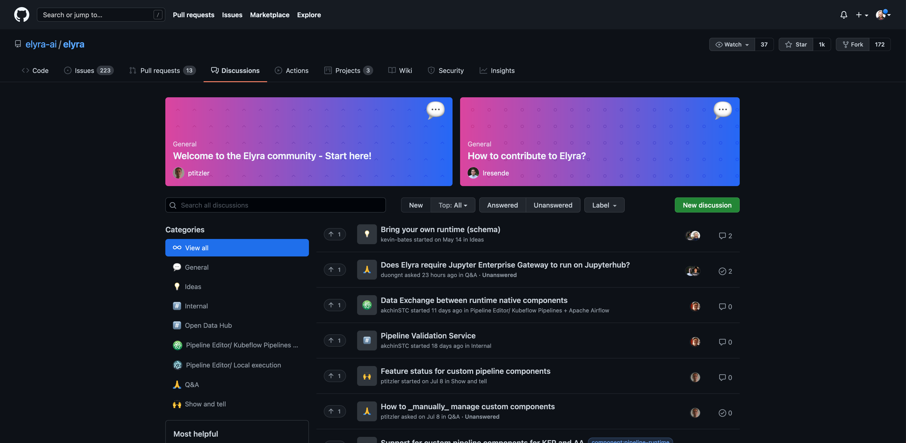
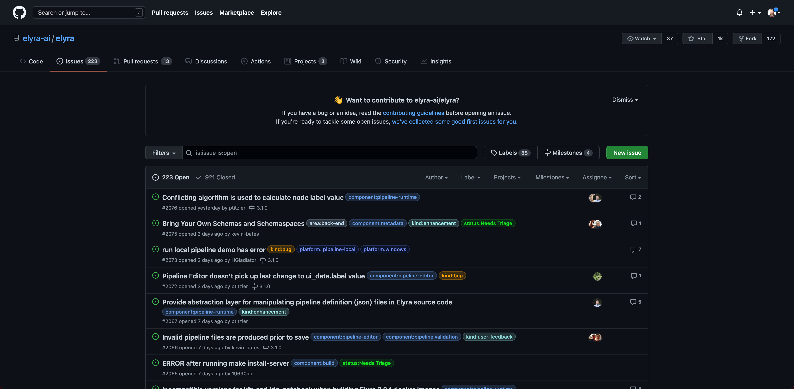
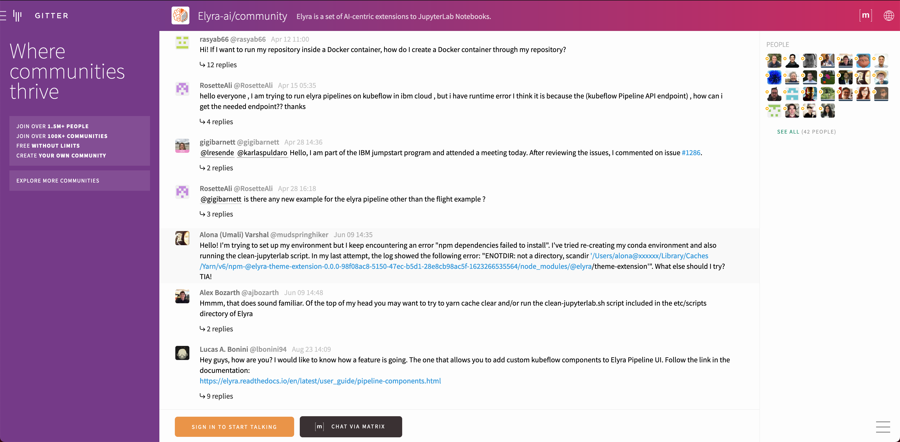

export const Title = () => (
  
    Getting help
  
);

<PageDescription>

Thank you for your interest in Elyra!

</PageDescription>

<AnchorLinks>
  <AnchorLink>General questions</AnchorLink>
  <AnchorLink>Create an issue or feature request</AnchorLink>
  <AnchorLink>Join the weekly community meeting</AnchorLink>
  <AnchorLink>Elyra chat room</AnchorLink>
</AnchorLinks>

## General questions

Share your questions and ideas with the community in the [GitHub discussion forum](https://github.com/elyra-ai/elyra/discussions).

<Row>
<Column colMd={7} colLg={7} >

</Column>
</Row>

## Create an issue or feature request

If you encounter a problem or have suggestions for improvements please [open an issue](https://github.com/elyra-ai/elyra/issues) on GitHub.

<Row>
<Column colMd={7} colLg={7} >

</Column>
</Row>

## Join the weekly community meeting

The Elyra community meeting is held [online](https://ibm.webex.com/meet/akchin) every Thursday at [9AM Pacific](https://www.thetimezoneconverter.com/?t=9%3A00%20am&tz=San%20Francisco&) (excluding holidays).

## Elyra chat room

You can reach many Elyra contributors in the [Elyra community](https://gitter.im/elyra-ai/community) on gitter.

<Row>
<Column colMd={7} colLg={7} >

</Column>
</Row>
