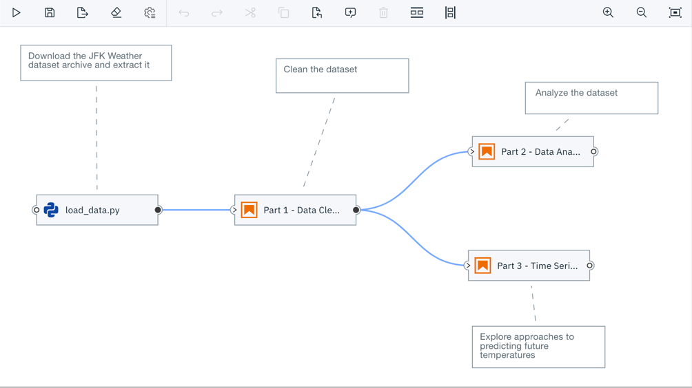
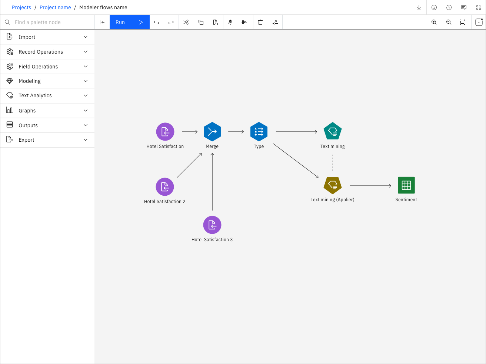
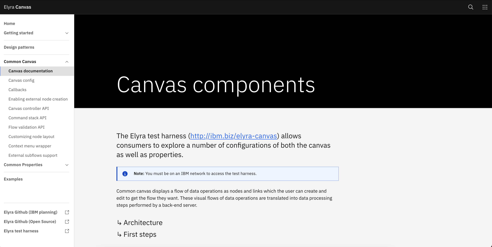

<PageDescription>

  </PageDescription>

  <AnchorLinks>
  <AnchorLink>How do I use this site?</AnchorLink>
  <AnchorLink>Who should use this site?</AnchorLink>
</AnchorLinks>

## How do I use this site?

<Row>

<Column colMd={8} colLg={8}>

Elyra is a powerful tool comprised of two areas of interest: **AI** and **Canvas**. Each of these areas has their own sections in the navigation.

</Column>
</Row>

<Row>
  <Column colMd={4} colLg={4} noGutterMdLeft>

</Column>
<Column colMd={4} colLg={4} noGutterMdLeft>

</Column>
</Row>

### Elyra AI

<Row>

<Column colMd={6} colLg={8}>
  
  Elyra AI is a set of AI-centric extensions to JupyterLab Notebooks. Use the framework to simplify and build AI pipelines from notebooks, Python scripts and R scripts.

 

  

</Column>
</Row>

### Elyra Canvas

<Row>
    <Column colMd={6} colLg={8}>
     
With Elyra canvas, you can leverage the components and resources of the Elyra canvas experience as you create drag-and-drop UIs with near infinite configurable options.

 

  

</Column>
</Row>

## Who should use this site?

Developers seeking documentation have come to the right place! This site exists for the express purpose of getting users up and running for both the Elyra AI and Elyra Canvas experiences. 

Designers who are curious about design patterns (and have IBM credentials) may log in [here](https://ibm.biz/elyra-common-canvas) to view design patterns related to Elyra's experience.  

<Row>
    <Column colMd={6} colLg={8}>
     

  

</Column>
</Row>